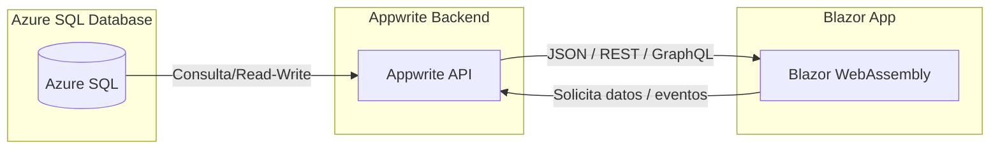

## Overview
*Note: This project is currently in active development. Due to confidentiality agreements, sensitive data and specific business logic have been omitted. This case study focuses on the system architecture and technical stack.*

Managing modern supply chains requires robust data pipelines and secure interfaces. I am currently architecting and developing a full-stack solution designed to handle complex relational data and provide real-time analytics capabilities.

## Technical Architecture
The core challenge of this project is establishing a seamless and secure flow of information from the database to the end-user interface.

- **Frontend Interface:** I am building the client-side application using **Blazor**, chosen for its component-based architecture and seamless integration with the .NET ecosystem.
- **Data Layer:** The relational data structure is hosted on **Azure SQL Database**. This ensures data integrity, high availability, and the performance required for complex analytical queries.
- **Backend Services:** To handle authentication and secure API routing efficiently, I integrated **Appwrite** as the Backend-as-a-Service (BaaS). This allows me to decouple the user management from the core data logic.

## Current Focus & Next Steps
My current development phase is focused on optimizing the data retrieval processes between Azure SQL and the Blazor frontend to ensure low latency. Moving forward, the goal is to implement advanced data caching strategies and finalize the UI components for data visualization.

This ongoing project is significantly deepening my expertise in cloud-based databases, secure data handling, and full-stack system design.